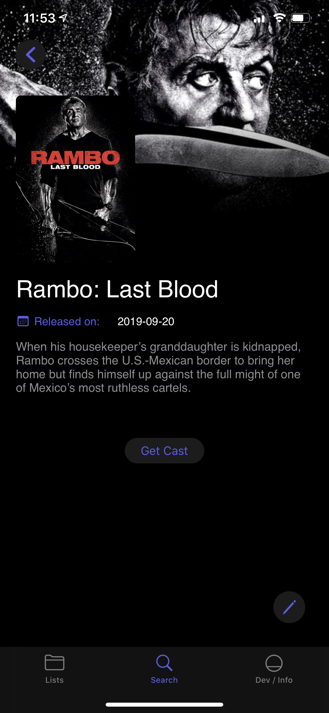
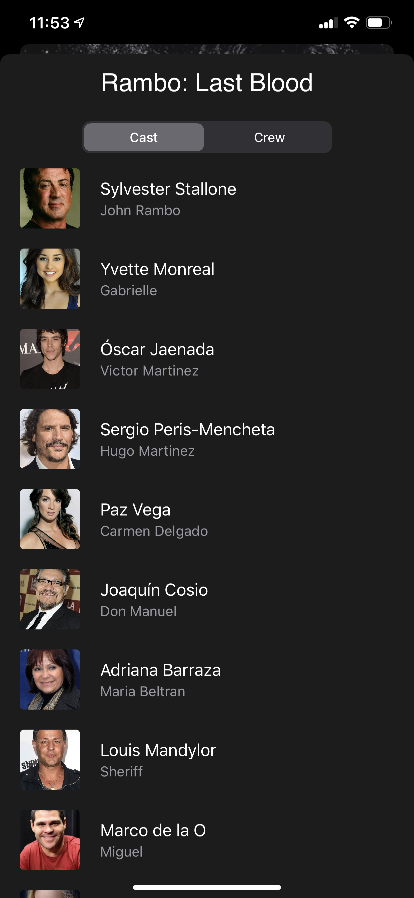
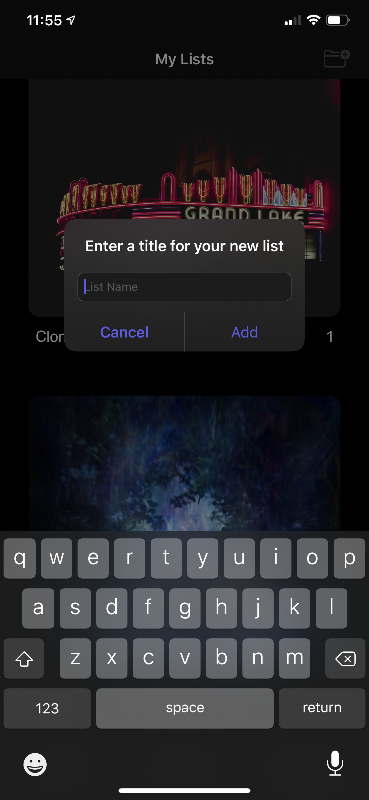
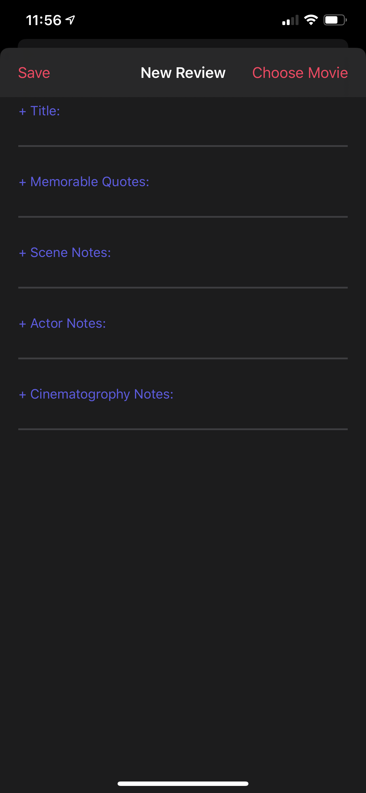
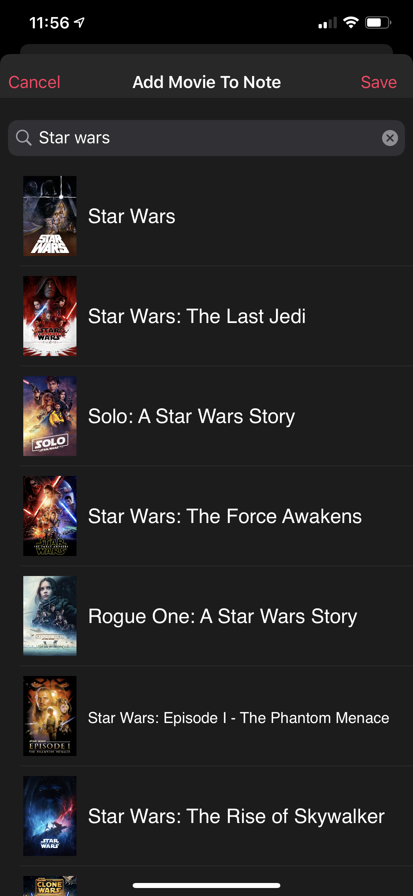

# _CineScribe_

### Description: CineScribe is an app that providez movie reviewers and vloggers a tool to record fresh ideas, thoughts, and feeling about a movie that was just seen.

### Developers:
  * Jeff Santana
  * Marlon Raskin
  
### Technologies:
  * UIKit
  * CoreData
  * Firebase
  * Pull to Reach
  * The Movie database API
  
### Target: iOS 13
  * Dark Mode
  * Contextual Menus
  * SF Symbols
  
  
  ## Screenshots
   
   
   
  
  

